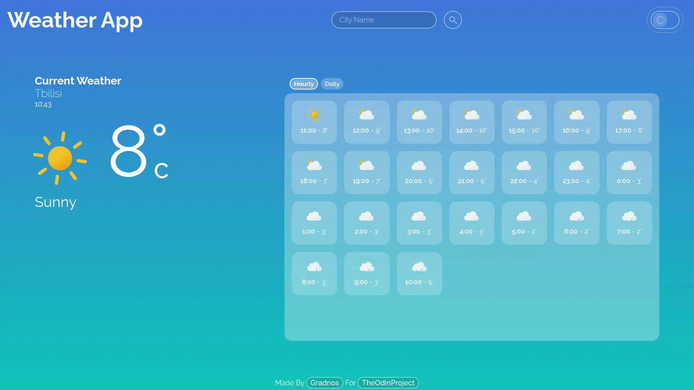
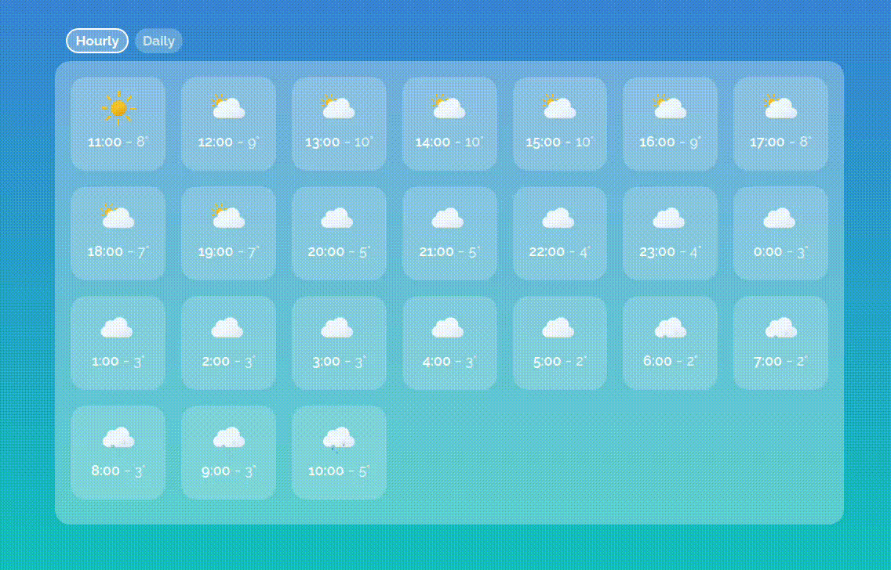

# 
A Weather project built with weatherAPI 

 

 

#

# Change temperature preference 

 

#

# View Daily Or Hourly Forecast

 

#

# Changes Background Depending On The Time

 

#

# What I Learned

- Using an API
- promises
- async
- await
- extracting information from complex objects
- Creating a toggle button
- using grid for responsive layout (in hourly and daily view)
          